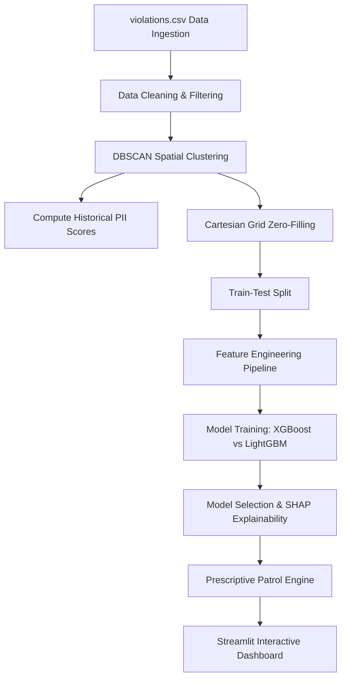

# AI-Driven Parking Intelligence Platform 🚗💡

> **Dual-Engine Spatial Prioritization, Predictive Hotspot Forecasting, & Prescriptive Resource Allocation System**

A modern spatial analytics and machine learning platform designed to identify, forecast, and operationalize parking enforcement. The system uses spatial clustering (DBSCAN), a multi-criteria decision index (PII), gradient boosted tree regressors (XGBoost/LightGBM), SHAP explainability, and a prescriptive rules engine for smart patrol dispatches.

---

## 🚀 Key Features

1. **Spatial Prioritization Engine (Parking Impact Index - PII)**
   * Groups spatial data points into density zones using **DBSCAN** with a physical-range haversine metric ($200\text{ meters}$).
   * Computes a multi-criteria index ($0-100$) scoring each hotspot across six proxy indicators:
     * **Density:** Offenses per square meter (using Scipy Convex Hull spatial projection).
     * **Peak Hours:** Commuter congestion ratio (morning 8-10, evening 17-20).
     * **Persistence:** Temporal occurrence consistency across tracking days.
     * **Vehicle Weight:** Average vehicle weight impact (e.g., Trucks weighted higher than scooters).
     * **Violation Severity:** Risk/hazard mapping of violation categories.
     * **Junction Criticality:** Violation occurrence ratio at intersection locations.
   * Classifies hotspots into operational risk levels (`Low`, `Medium`, `High`, `Critical`).

2. **Predictive Machine Learning Engine**
   * Prepares an unbiased zero-filled spatial-temporal Cartesian grid ($\text{Cluster} \times \text{Hour} \times \text{DOW} \times \text{Month}$).
   * Explores and trains dual gradient boosted engines (**XGBoost** & **LightGBM**).
   * Automatically evaluates test metrics ($R^2$ and $\text{RMSE}$) and serializes the best performing model.

3. **🔍 Hackathon Special: Model Explainability (SHAP)**
   * Implements **SHAP (SHapley Additive exPlanations)** diagnostics.
   * Renders global feature importance summary plots and waterfall plots for individual prediction transparency directly on the dashboard.

4. **Prescriptive Patrol & Rules Engine**
   * Aligns predictive outputs to dispatch plans, automatically recommending **suggested patrol units** ($1 - 4$) and **enforcement priority ranks** ($1 - 4$).

5. **Interactive UI Dashboard**
   * Interactive Folium mapping overlays (Heatmap, interactive cluster markers with sub-score popups).
   * Plotly visualizations (radar profiles, comparative grouping bar charts, and forecasting charts).

---

## 📐 Mathematical Formulation

### 1. Convex Hull Area Ingestion
Coordinates are projected from degrees to local Mercator meters:
$$x = \text{lon} \times 111,320 \times \cos(\text{lat}_{rad}), \quad y = \text{lat} \times 110,574$$
$$\text{Area } (m^2) = \text{ConvexHull}(x, y)$$

### 2. Weighted Parking Impact Index (PII)
$$\text{PII} = 0.30 \cdot S_{density} + 0.20 \cdot S_{peak} + 0.15 \cdot S_{persistence} + 0.15 \cdot S_{vehicle} + 0.10 \cdot S_{violation} + 0.10 \cdot S_{junction}$$
*(Each sub-score $S_i$ is normalized between $0 - 100$ using min-max scaling before aggregation)*

---

## 📊 System Architecture



---

## 📁 Repository Structure

* [app.py](file:///c:/hackathon/Trafic-ai/app.py): The Streamlit web dashboard.
* [config.py](file:///c:/hackathon/Trafic-ai/config.py): Configuration, severity weights, and classifications.
* [data_pipeline.py](file:///c:/hackathon/Trafic-ai/data_pipeline.py): Preprocessing, DBSCAN, zero-filling, and the prescriptive engine.
* [impact_engine.py](file:///c:/hackathon/Trafic-ai/impact_engine.py): Spatial projection, area calculation, and PII scorer.
* [model_training.py](file:///c:/hackathon/Trafic-ai/model_training.py): Regressor models training, testing, pipeline execution, and SHAP evaluator.
* [requirements.txt](file:///c:/hackathon/Trafic-ai/requirements.txt): Environment dependencies.

---

## 🛠️ Setup & Running Instructions

### 1. Environment Setup
Install dependencies:
```bash
pip install -r requirements.txt
```

### 2. Run the Dashboard
Start the Streamlit web application:
```bash
streamlit run app.py
```
*Note: If `best_model.pkl` is not found, the application will automatically run the training pipeline first to compile and save the model.*

### 3. Manual Model Training
To retrain the regressor model manually:
```bash
python model_training.py
```

---

## 📖 Presentation Documentation
For detailed formulas, proxy mapping explanations, and machine learning structures, view the [hackathon_project_documentation.md](file:///C:/Users/BIT/.gemini/antigravity-ide/brain/478305e6-5dd5-470a-9955-45f696e65a78/hackathon_project_documentation.md) file.
